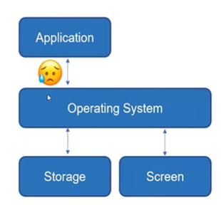
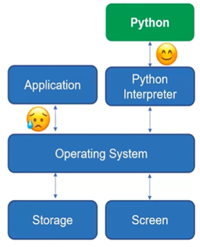
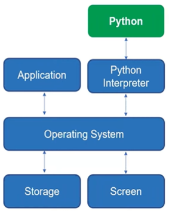

# 📝Lecture 1 : Abstraction, Hello! Python, Memory and Reassignment

## Contents📑

* What is Data Science?[✏️](#0)
* Abstraction[✏️](#1)
* Hello! Python[✏️](#2)
* Memory and Reassignment[✏️](#3)

## What is Data Science?[📑](#contents)

> [강의 URL🎬](https://youtu.be/xyTAi70RReQ)

**Data Science?**

* A-B-C : AI/Algorithm - Bigdata - Computing + D : Domain -> Application : 데이터의 소스가 발생
* Drawing useful **conclusions** from data using **computation**.
  * 빅데이터 시대이기에 컴퓨터를 잘 사용하는 것이 중요함.
  * 결론을 위해 데이터를 이해하기 위해 다양한 전공이 유효함.

**Computer Science?**

* Making computers do what you want to do **efficiently** (for your **productivity**)
* 컴퓨터를 잘쓰는 것이 중요함
* 다양한 종류의 컴퓨터가 내가 하고자 하는 일을 할수 있도록 자유자재로 부려먹어야 함.
* 컴퓨터가 **효율적이어야** 나의 **생산성**이 올라감

**Algorithms and Programs**

* **Logical** steps(recipe)
* Written in a **computer language **(instruction set)
* 컴퓨터가 따라 갈수 있는 완벽한 논리적 구조를 재현해야 함.
* 프로그램은 특정한 language -> `Zero Ambiguity`를 가짐

## Abstraction[📑](#contents)

> [강의 URL🎬](https://youtu.be/xyTAi70RReQ)

**How does a computer run a `Python` program?**

* 운전을 한다고 가정하자!
  * 핸들을 언제 움직이는지? 페달을 언제 밟는지?
  * 테슬라, 버스, 트럭, 슈퍼카 등 차의 종류에 무관하게 운전을 하는 방법만 알면 된다.
  * 운전을 하는 인터페이스만 알고 있으면 운전하는데 문제가 되지 않음.

Driver do not need to know **implementation** details about a car to drive it

*  tire, wheel, engine, size, weight

They just need to deal with user **interfaces**, such as handle and pedals

* Once they know how to handle interfaces, they can drive all of various cars in the worls

**Abstraction** : The process of preserving information that is relevant in a given context, and forgetting information that is irrelevant in that context

* We cannot remember and focus on many things at a time...
* People with different expertise/interest can focus on their jobs without worrying about other part

* 내 코드의 구현의 디테일을 알아야만 내 코드를 알 수 있으면 안됨. -> 협업을 힘들게 만듦.
* Abstraction을 통해 전체 아이디어를 알수 있도록 만들어야 함. -> Abstraction 방식의 토론!

**Abstraction - Machine Learning**

If you don't understand, don't worry about it. - Andrew Ng

TensorFlow, pytorch // matlab(abstraction이 별로 없음.)

**Abstraction - Mobile Phone**

* 스마트폰의 경우

  갤럭시, 구글 픽셀, 샤오미(Hardware) - `Android`(Operation System) - 인스타그램, 줌, 넷플릭스, 지메일(Application)

**Abstraction - More General Computer**

* Application : 줌, 로스트아크, 파워포인트
* OS : window11
* H/W : 네트워크, CPU, 스피카, 모니터 등등

완전히 설계가 나뉘어 있음.

**Abstraction - Thank you Operating System!**

* Operation system(e.g., MS Window, Linux, macOS) is the only program in the computer that's allowed **direct access** to the hardware
* If any other application program wants to interact with hardware (fetch data from storage, draw on the screen, find out what key was just pressed on the keyboard), it sends a **request** to the OS(**indirect access**)
* If you are not writing an OS,  you don't need to care about hardware but OS
  * Some smartphone Apps support either Android or iOS, not both of them
  * Once an app is ported on Android, it works for all different kinds of Android phone

**Abstraction - Thank you Interpreter!**

* OS is still too low and complex to directly program an application on...

  * If you are not a hardcore programmer

* Another layer for you, called **Interpreter**

  * If you write a program using Python, the interpreter takes your program, translate it into a language that OS understands

  

* Now you don't have to worry about OS too! Just write a program and it will run on variuos OSes! 

**Python Interpreter**

* Multiple ways of playing with Python
  * Execute a Python program that is saved in a file with `a.py` extension
    * The interpreter will execute **the whole program** in the file
* Execute a program called a **shell**, and type Python statements one at a time
  -> 쉘을 사용하면 그때그때 인터프리터가 실행됨.
  * The interpreter will execute **each statement** when you type it
* Execute **jupyter notebook**, type and execute a group of Python statements
  * The interpreter will execute **the group of statements**
    -> 그룹을 가지고 인터프리터가 실행되어 편하게 사용할 수 있음.

### Summary

* Abstraction - Interface and implementation
  * For now, it is OK to know only interfaces
  * To become a power user, you need to learn **low level system programming**!
* Operating system and application
* Python Interpreter

